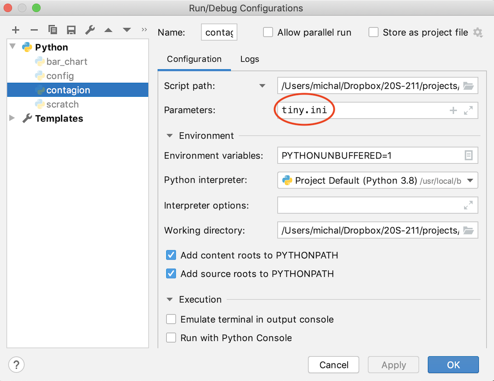
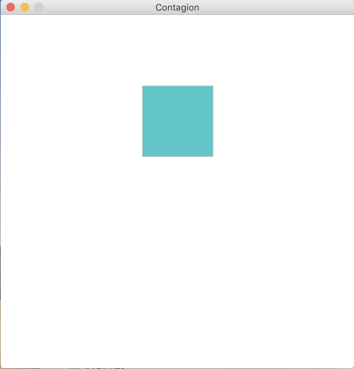
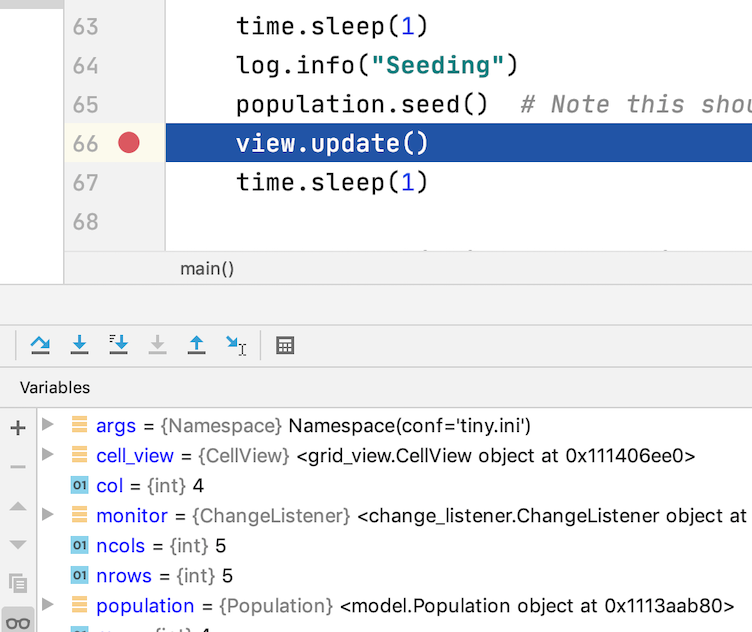
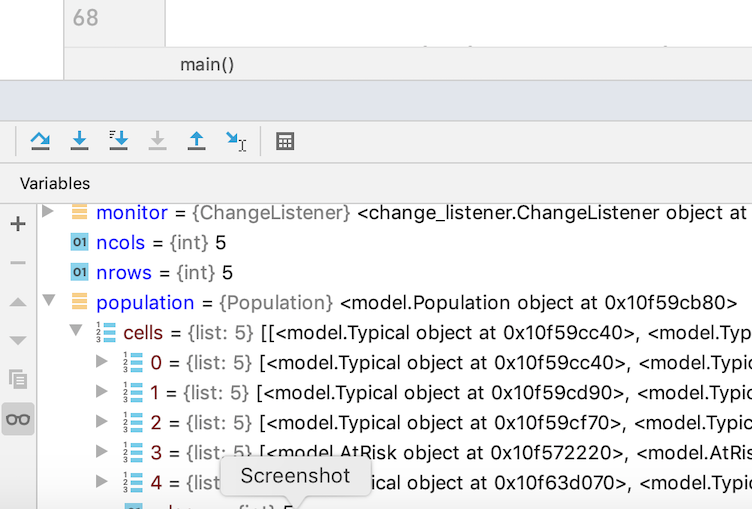
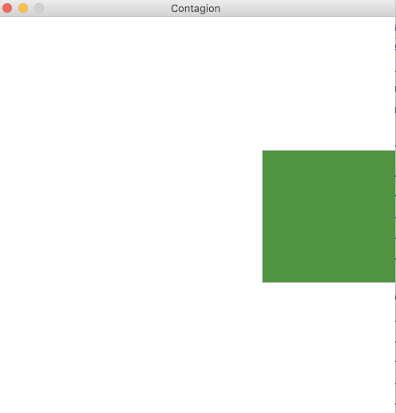
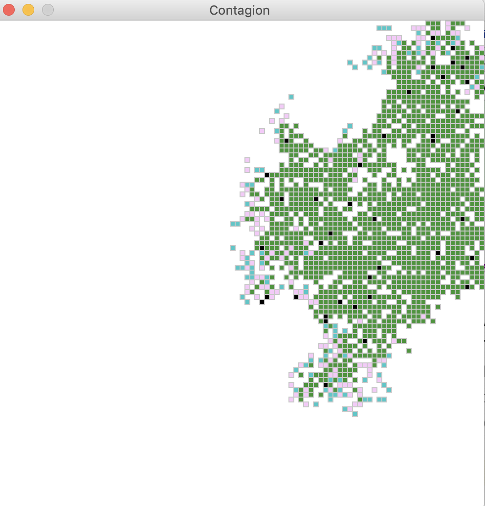

## Contagion Model HOWTO

I generally try to organize a project HOWTO in a 
real or at least plausible order that it might be 
developed from scratch.  However, the actual order 
of development order for a simulation would never 
consist of writing a little code, then adding more, 
then adding more.  It would instead consist of writing
some code, then erasing part and replacing it with more, 
then erasing part and replacing it with more, etc., 
and inevitably over several files.  I believe students 
would find it frustrating to be asked to write a lot 
of code that they then throw away to replace it, and it 
would take more time. 

Instead of a realistic order, then, this construction 
plan is organized to build up and fit into an overall 
framework that is already built up to accommodate the 
completed project. 

## Beginning model.py

The module that you will build is in file 'model.py', 
which you should create. 

There are three other files that import model.py. Our 
first goal will be to create the simplest possible model.py
that will allow us to execute the other modules that 
depend on it. 

### contagion.py

The main program module is `contagion.py`. 
We can see that it imports `model` and 
accesses class `model.population`.  We can also 
see that it directly accesses an instance variable 
`cells` in `model.py`: 

```python
    population = model.Population(nrows, ncols)
    ...
    for row in range(nrows):
        for col in range(ncols):
            cell_view = grid_view.CellView(row, col, view)
            population.cells[row][col].add_listener(cell_view)  # Graphics
            population.cells[row][col].add_listener(monitor)    # Change tracking
```
Thus to get started, we need at minimum the class 
`Population` containing a matrix of cells, and these 
cells must have an `add_listener` method.  The 
`Population` object itself must have a `seed` method. 

File `grid_view.py` also imports `model`.  In 
`grid_view.py` we can see that class `CellView` 
accesses a cell in the population.  It expects that 
cell to be a subclass of `mvc.Listenable` and to 
have an instance variable `state`, and that 
the values of `state` should index the `STATE_COLOR` 
dict: 

```python
STATE_COLORS = {
    model.Health.vulnerable: color_rgb(0, 200, 100),
    model.Health.asymptomatic: color_rgb(50, 200, 200),
    model.Health.symptomatic: color_rgb(250, 200, 250),
    model.Health.recovered: color_rgb(50, 150, 50),
    model.Health.dead: color_rgb(0, 0, 0)
}
```

`contagion.py` also attaches a `ChangeListener` object
to each cell.  Looking at `change_listener.py` we can 
see that the `ChangeListener` class expects a cell to 
be an instance of class `Individual` but has no 
other dependencies.   

With these observations, we can attempt to construct
the absolute minimum `model.py` file to get started. 

## model.py starter

The relation between `model.py` and `grid_view.py` 
follows the model-view-controller (MVC) pattern, 
so we'll begin by important abstract base classes 
from `mvc.py`.  We'll create a class `Population`
that inherits from `mvc.Listenable`, and create within 
it a set of cells that are of class `Individual` 
and that are also subclasses of `Listenable`. Moreover, 
we'll need to create the enumeration `Health` and 
create a `state` instance variable in cells of 
class `Individual`.  

We'll add a simple `__str__` 
method to the `Health` enum just to improve
the formatting of output.  We'll also import and 
configure the `logging` module, which will be 
useful in debugging. 

```python
"""Simple grid model of contagion"""

import mvc  # for Listenable
import enum
from typing import List, Tuple

import logging
logging.basicConfig()
log = logging.getLogger(__name__)
log.setLevel(logging.DEBUG)


class Health(enum.Enum):
    """Each individual is one discrete state of health"""
    vulnerable = enum.auto()
    asymptomatic = enum.auto()
    symptomatic = enum.auto()
    recovered = enum.auto()
    dead = enum.auto()

    def __str__(self) -> str:
        return self.name


class Individual(mvc.Listenable):
    def __init__(self):
        super().__init__()
        self.state = Health.vulnerable

class Population(mvc.Listenable):
    def __init__(self, nrows: int, ncols: int):
        super().__init__()
        self.cells = []
        self.nrows = nrows
        self.ncols = ncols
        # YOU FILL THIS IN

    def seed(self):
        pass  #FIXME soon
```

After copying this code and filling in the 
initialization of the `cells` list, you should 
have a working but very, very boring simulation. 
It displays a pair of blank graphics windows and 
prints something like this: 

``` 
INFO:config:Configuring from file contagion.ini
INFO:__main__:Seeding
INFO:__main__:Running
Peak 0 symptomatic on day 0
Peak 0 deaths on day 0
Press enter to close
```

## Tick-Tock

In a simulation model of this kind, we need to make it
appear as if time passes in discrete moments, with every 
cell (every individual person modeled) making changes 
simultaneously in one *tick* of a clock. Our simulated 
clock will make one *tick* per day.  The changes made 
by one person may depend on the state of other nearby 
people, and in particular, we want to model a limited amount
of disease spread on each clock tick. 

Let us suppose we are calculating the one day disease spread
on Tuesday.  Initially all of the individuals are in the 
state they were in at the end of Monday.  Suppose we first 
compute a new state for individual Marge, and then a 
new state for Homer, who lives near Marge.  If either 
Marge or Homer could infect each other, we want the new 
state of Marge to depend on the state Homer was in on 
Monday, and the new state of Homer to depend on the state 
Marge was in on Monday; the order in which we calculate 
new states for each individual should not matter. 

There is a simple way to accomplish this.  We must divide
the simulation of each day passing into two parts: 
Computing the next state for each individual, and 
updating the current state to the new state. 
We must do all of the new state computations (all based 
on the current state) before updating any of the states. 

In our Population object, a `step()` of the simulation 
will make two separate loops through all of the cells. 
The first loop calls the `step()` method of each cell, 
which calculates the next state for that cell.  The 
second loop calls the `tick()` method of each cell to 
make the newly computed state current. 

```python
    def step(self):
        """Determine next states"""
        log.debug("Population: Step")
        # Time passes
        for row in self.cells:
            for cell in row:
                cell.step()
        for row in self.cells:
            for cell in row:
                cell.tick()
        self.notify_all("timestep")
```

Of course we will need to add `step` and `tick` methods 
to the `Individual` class.  We will postpone deciding 
how the next state computation works, but we can make 
the `tick` operation advance to the next state.  
We will need to add a `next_state` instance variable, 
which we can initialize to be `vulnerable`. 

```python
class Individual(mvc.Listenable):
    def __init__(self):
        super().__init__()
        self.state = Health.vulnerable
        self.next_state = Health.vulnerable
        
    def step(self):
        # FIXME soon
        pass
```

The `tick` method is initially simple: 

```python
    def tick(self):
        """Time passes"""
        self.state = self.next_state
```

We will add to the `tick` method soon, when we consider 
how some longer state transitions occur, but this will do
for now. 

## Patient 0

It's time to make someone sick. 

*Patient 0* is the name often given to the first 
person in some region who becomes infected with a 
contagious disease.  The purpose of the `seed` method
in `Population` is to infect this person.  We'll 
pick one individual at random.  At the head of the 
file we'll need: 

```python
import random
```

Then in `Population`, we'll select some unfortunate
individual to infect: 

```python
    def seed(self):
        """Patient zero"""
        row = random.randint(0,self.nrows-1)
        col = random.randint(0,self.ncols-1)
        self.cells[row][col].infect()
        self.cells[row][col].tick()
```

The `infect` method for an individual will also be simple: 

```python
    def infect(self):
        """Called by another individual spreading germs.
        May also be called on "patient 0" to start simulation.
        """
        if self.state == Health.vulnerable:
            self.next_state = Health.asymptomatic
```

Note that we are assuming that only a patient in the 
`vulnerable` state can be infected.  Patients that are 
`recovered` are assumed to be immune (which may or may not
be realistic, depending on the disease), and also `dead`
people do not get sick. 

Also note that the state upon becoming infected is 
`asymptomatic`, meaning that the individual is not 
yet showing symptoms of disease.  Shortly we will have 
to consider how the transition from `asymptomatic` to 
`symptomatic` works, as well as the transition from 
`symptomatic` to `recovered` or `dead`. 

## Keeping Statistics 

If we attempt to run `contagion.py` at this point, it will 
crash with a message about another method that we need 
to add to `Population`: 

``` 
  File "/Users/michal/Dropbox/20S-211/projects/dev/contagion/contagion_stats.py", line 33, in update
    current_cases = self.pop.count_in_state(model.Health.symptomatic)
AttributeError: 'Population' object has no attribute 'count_in_state'
```

The `count_in_state` method of `Population` should return 
a count of the number of individuals in the specified 
state: 

```python
    def count_in_state(self, state: Health) -> int:
        """How many individuals are currently in state?"""
```

I will leave writing that method to you. 

At this point we can run `contagion.py` and obtain some 
output.  It will print something like: 

``` 
INFO:config:Configuring from file contagion.ini
INFO:__main__:Seeding
INFO:__main__:Running
DEBUG:model:Population: Step
DEBUG:model:Population: Step
DEBUG:model:Population: Step
DEBUG:model:Population: Step
DEBUG:model:Population: Step
DEBUG:model:Population: Step
DEBUG:model:Population: Step
DEBUG:model:Population: Step
DEBUG:model:Population: Step
DEBUG:model:Population: Step
Day  10	   0 symptomatic	   0 cumulative deaths (   0 this period)
Peak 0 symptomatic on day 0
Peak 0 deaths on day 0
Press enter to close
```

It will also display two windows.  One of these is a grid
that shows one square for each individual.  The other is 
a bar graph (which should currently be blank). 

## Configuration 

Note that the first line of the output describes a 
*configuration file*.  If you look within `contagion.ini`
you'll find a large number of settings: 

```ini
DEFAULT]
# Disease parameters
P_Transmit = 0.25
T_Recover = 5
T_Incubate = 2

[Grid]
Width = 500
Height = 500
Rows = 100
Cols = 100
# Proportions of different kinds of individuals
Proportion_AtRisk = 20
Proportion_Typical = 80
...
```

Simulation models are run over and over with different 
settings, fine tuning and checking the effects of changes. 
We prefer to have those settings together in an external 
*configuration file* rather than coding them in Python, 
and we especially do not want them scattered around in 
the Python code.  

To make it easier to vary configurations and experiment, 
`contagion.py` has a command line option to allow choosing
a configuration file different from the default 
`contagion.ini`.  

Some of the parameters in the configuration file control 
the size of the model and the sizes of the graphics windows 
in which the model is displayed.  Testing and debugging a 
simulation model is challenging, both because it has a lot
of parts and because its behavior is involves random choices. We 
can make debugging a little easier by creating special 
configurations that are much smaller.  

`minimal.ini` is a configuration with a population of only
9 individuals.  It also has some random choices, which 
typically range from a probability of 0.0 to 1.0, set 
to extreme values so that behavior is more predictable. 
We can configure PyCharm to run our model with this 
special configuration: 



If we run it with this configuration, it is easy to see Patient 0. 



## Subclasses 

We can vary and control quite a bit with configuration files.  In particular, 
configuration files are almost always the best place to put numerical 
parameters like the size of the population or the likelihood that a virus
will pass to a healthy person who visits an infected person.  Some kinds of 
variation, however, are better expressed as Python code.  Subclassing 
and inheritance are convenient ways for us to organize this variation. 
We can have different kinds of individuals who have some things in common, 
but also some variations.  We can make `Individual` an abstract base class,
where we keep what all individuals have in common.  Concrete subclasses can 
inherit most of the common behavior, but they can also provide methods for 
some behavior that is unique to a group of individuals.

Initially we will make just one subclass, which we will call `Typical`.  
Soon we will add another subclass, `AtRisk`, for individuals who are 
more at risk from the contagion, and who consequently act more cautiously. 

While we would like to have subclasses that can act differently, we 
would still like to use numeric parameters from the configuration file as 
much as possible, and reading those parameters is something that all the 
subclasses have in common ... even if they read different values!  
Thus we will keep the configuration reading code in the base class 
`Individual`, but each subclass will direct the constructor of `Individual` 
on which specific set of parameters to read.  For example ... 

```python
class Typical(Individual):
    """Typical individual. May visit different neighbors
    each day.
    """
    def __init__(self, region: Population, row: int, col: int):
        # Much of the constructor has been "factored out" into
        # the abstract base class
        super().__init__("Typical", region, row, col)
```

Class `Typical` calls the superclass constructor of Individual, but 
provides the argument "Typical" to direct it to read configuration
parameters specific to the `Typical` class.  The constructor for `Individual`
uses the `kind` argument to access the parameters: 

```python
class Individual(mvc.Listenable):
    """An individual in the population,
    e.g., a person who might get and spread a disease.
    The 'state' instance variable is public read-only, e.g.,
    listeners can check it.
    """

    def __init__(self, kind: str,
                 region: Population, row: int, col: int):
        # Listener needs its own initialization
        super().__init__()
        self.kind = kind
        self.region = region
        self.row = row
        self.col = col
        # Initially we are 'vulnerable', not yet infected
        self._time_in_state = 0  # How long in this state?
        self.state = Health.vulnerable
        self.next_state = Health.vulnerable
        # Configuration parameters based on kind
        self.T_Incubate = config.get_int(kind, "T_Incubate")
        self.P_Transmit = config.get_float(kind, "P_Transmit")
        self.T_Recover = config.get_int(kind, "T_Recover")
        self.P_Death = config.get_float(kind, "P_Death")
        self.P_Greet = config.get_float(kind, "P_Greet")
        self.N_Neighbors = config.get_int(kind, "N_Neighbors")
        self.P_Visit = config.get_float(kind, "P_Visit")
        self.Visit_Dist = config.get_int(kind, "Visit_Dist")
```
We haven't written the code that uses all these parameters yet,
but I've included them here so that we won't have to go back and 
add them later one by one. The `config` module does the actual reading. 
It uses the `configparser` module in the Python library, so for 
example the value for `N_Neighbors` for kind `Typical` will come from 
this section of file `minimal.ini`:

```ini
[Typical]
P_Death = 0.001  # 0.1% chance of dying on a single day
Visit_Dist = 2   # Visit up to n steps away
P_Visit = 0.5
N_Neighbors = 3  # How many neighbors do I visit over time
P_Greet = 0.85   # Welcome most visitors
```

For the moment we will let `Population` make all the cells be of 
kind `Typical`, but we'll change that shortly.  Soon we will be
creating some social behavior in which individuals interact with 
neighbors close to them in the grid, so we'll also provide them 
with the information they need for identifying neighbors.  

```python
class Population(mvc.Listenable):
    """Simple grid organization of individuals"""

    def __init__(self, rows: int, cols: int):
        super().__init__()
        self.cells = []
        self.nrows = rows
        self.ncols = cols
        # Populate according to configuration
        for row_i in range(config.get_int("Grid", "Rows")):
            row = []
            for col_i in range(config.get_int("Grid", "Cols")):
                row.append(Typical(self, row_i, col_i))
            self.cells.append(row)
        return
```

## Another subclass: AtRisk

The point of what we did above was to allow us to have more 
than one kind of individual.  We'll create another subclass, 
`AtRisk`.  Even though we haven't defined any difference in 
behavior among the subclasses, each `AtRisk` individual will 
get numerical parameters that differ from those a `Typical`
individual gets: 

```python
class AtRisk(Individual):
    """Immunocompromised or elderly.
    Vulnerable and cautious.
    """
    def __init__(self, region: "Population", row: int, col: int):
        # Much of the constructor has been "factored out" into
        # the abstract base class
        super().__init__("AtRisk", region, row, col)
```

But now we have a problem ... the loop we wrote to fill in cells 
in class `Population` is creating only `Typical` individuals.  
How can we create a mix of `Typical` and `AtRisk` individuals? 

## Rolling the Dice

We would like to have some proportion of individuals of different 
kinds, specified in the configuration file, e.g., 

```ini
# Proportions of different kinds of individuals
Proportion_AtRisk = 30
Proportion_Typical = 70
```

Within the constructor for `Population`, we will replace 
```python
                row.append(Typical(self, row_i, col_i))
``` 
by 
```python
                row.append(self._random_individual(row_i, col_i))
```
and then write a `_random_individual` method that creates either 
a `Typical` or an `AtRisk` individual randomly, in the specified 
proportions.  We would also like to make it easy to add more classes 
of individuals later.  

The proportions given in the configuration file are out of 100.  
The function `random.random()` produces a random number between 0.0 and 
1.0.  If the proportions of `Typical` and `AtRisk` are p and (1-p), 
then we could write `_random_individual` like this: 

```python
    def _random_individual(self, row: int, col: int) -> "Individual":
        proportion_at_risk = config.get_float("Grid", "Proportion_AtRisk")
        dice = random.random()
        if dice < proportion_at_risk:
                return AtRisk(self, row, col)
        else:
                return Typical(self, row, col)
```

However, this code will get longer and harder to get right if we 
add more subclasses.  We can do a little better by keeping all the 
possible classes and the corresponding configuration labels in a 
list: 

```python
    def _random_individual(self, row: int, col: int) -> "Individual":
        classes = [(AtRisk, config.get_float("Grid", "Proportion_AtRisk")),
                   (Typical, config.get_float("Grid", "Proportion_Typical"))]
        while True:
            for the_class, proportion in classes:
                dice = random.random()
                if dice < proportion:
                    return the_class(self, row, col)
```

Aside: Notice that you can iterate through the parts of each tuple in a 
list of tuples very simply in Python.  For example, 

```python
for x, y in [(1, 2), (3, 4)]:
         print(x + y)
```
prints 3 and then 7. 

### Inspecting

It is very hard to write a test case that would check whether we have 
created a random assortment of individuals in approximately the 
right proportion.  We could write some scaffolding code to help 
inspect the `Population` object, but the simplest approach is to use 
the debugger.  We can place a breakpoint in `contagion.py` somewhere after the 
`Population` object has been initialized and before the program ends: 



Then, if we run the program in the debugger, we can simply look at the 
elements of `population.cells`:



Is it correct? We would need to run it many times and count the 
proportion of at-risk individuals to typical individuals each time 
to determine whether the proportions are correct, but checking them 
a couple times in the debugger is enough to give us some confidence 
that they look reasonable. 

## Time for action! 

So far our model of contagion is very boring:  One person gets sick, 
and stays sick forever.  It's time to make our simulated world a 
little more dynamic.  

We'll start by making the disease have a natural progression:  When a 
vulnerable person is infected, they are at first asymptomatic.  After 
a few days, they show symptoms. Each day with symptoms, there is some
chance (hopefully small!) that they may die.  If they do not die, then 
after some time they will recover.  The numerical parameters that
describe this progression are in the configuration file: 

```ini
[DEFAULT]
# Disease parameters 
T_Recover = 5
T_Incubate = 2
# ...
[Typical]
P_Death = 0.001  # 0.1% chance of dying on a single day
# ... 
[AtRisk]
P_Death = 0.02  # 2% chance of dying on a single symptomatic day
# ... 
```

`T_Incubate` is the number of days that an individual is asymptomatic. 
`T_Recover` is the number of days that they are symptomatic before 
they become well.  These two parameters are the same for typical and 
at-risk individuals.  A typical individual has a relatively low chance 
of dying on any given day, but an at-risk individual has a 2% chance 
of dying each day (so over a 5 day period with symptoms they have 
almost a 10% chance of dying). 

To mark the passage of time (e.g., the number of days an individual has 
been infected but asymptomatic), we'll add update a `time_in_state` 
instance variable in the `tick` method, which is now 

```python
    def tick(self):
        """Time passes"""
        self._time_in_state += 1
        if self.state != self.next_state:
            self.state = self.next_state
            self.notify_all("newstate")
            # Reset clock
            self._time_in_state = 0
```

Although the parameters differ between typical and at-risk individuals, 
they differ only numerically. We can replace the initial placeholder 
`step` method in `Individual` with code that simply tracks the progress 
of disease in an individual, finishing with a call to a `social_behavior`
method that will be implemented separately in each subclass. 

```python
    def step(self):
        """Next state"""
        # Basic state transitions are in common
        if self.state == Health.asymptomatic:
            if self._time_in_state > self.T_Incubate:
                self.next_state = Health.symptomatic
                log.debug("Becoming symptomatic")
        if self.state == Health.symptomatic:
            # We could die on any time step before we recover
            if self._time_in_state > self.T_Recover:
                log.debug(f"Recovery at {self.row},{self.col}")
                self.next_state = Health.recovered
            elif random.random() < self.P_Death:
                log.debug(f"Death at {self.row},{self.col}")
                self.next_state = Health.dead

        # Social behavior differs among concrete classes
        self.social_behavior()
```

For the moment let's "stub out" a `social_behavior` method in class `Individual`, 
so that we can check our progress: 

```python
    def social_behavior(self):
        #FIXME this should be implemented in subclasses
        pass
```

If we run our model at this point, still only one individual will 
become infected, and whether that person gets well or dies depends 
largely on the settings of parameters `T_Recover` and `P_Death`. 
The simulation will end with a green cell indicating the ill individual 
recovered or a black cell indicating the ill individual died. 



## Spreading disease

The essence of a contagion model is, of course, contagion: 
One individual can spread illness to others.  The spread
may depend on behavior:  How many people the individual visits, 
how often, and where.  This is where the social behavior comes in.

We'll begin by making social behavior be an *abstract* method in
class `Individual`:

```python
    def social_behavior(self):
        raise NotImplementedError("Social behavior should be implemented in subclasses")
```

Then we can stub it out in `AtRisk` and in `Typical`: 

```python
    def social_behavior(self):
        """The way a Typical individual interacts with neighbors"""
        pass
```

Re-run the model at this point to make sure it is still working. 
Nothing should be changed. 

## Will you be my neighbor? 

If an individual is going to be social with their neighbors, they're 
going to need some neighbors.  A typical individual might be social 
with more neighbors than an individual who is at risk, so this number 
is controlled by the configuration parameter `N_Neighbors`.  We would 
like to determine the neighbors of each individual in its constructor,
but since not all of its neighbors might exist yet, we will obtain a 
list of addresses rather than the neighbors themselves.  Neighbor 
addresses are determined by walking around randomly within a few 
blocks of home and throwing dice to determine who to be friendly with. 
This method, which is a little long but really not 
 very complicated, goes in `Population`: 
 
 ```python
    def neighbors(self, num: int, row: int, col: int, dist: int) -> List[Tuple[int, int]]:
        """Give me addresses of up to num neighbors
        up to dist away from here(Manhattan distance)
        """
        result = []
        count = 0
        log.debug(f"Cell {row},{col} finding {num} neighbors at distance {dist} " +
                  f"in {self.nrows},{self.ncols}")
        attempts = 0
        while count < num:
            attempts += 1
            assert attempts < 1000,(
                f"Can't find {num} neighbors at distance {dist}")
            row_step = random.randint(0-dist,dist)
            col_step = random.randint(0-dist,dist)
            row_addr = row + row_step
            col_addr = col + col_step
            # log.debug(f"Trying neighbor at position {row_addr},{col_addr}")
            if row_addr < 0 or row_addr >= self.nrows:
                # log.debug("Bad row")
                continue
            if col_addr < 0 or col_addr >= self.ncols:
                # log.debug("Bad column")
                continue
            if row_addr == row and col_addr == 0:
                # log.debug("Can't visit self")
                continue
            neighbor_addr = (row_addr, col_addr)
            if neighbor_addr in result:
                continue
            log.debug(f"{row},{col} adding neighbor at {row_addr},{col_addr}")
            result.append(neighbor_addr)
            count += 1
        return result
```

Since we are only giving addresses, we'll provide a method in `Population`
to get the actual `Individual` living at an address: 

```python
    def visit(self, address: Tuple[int, int]):
        """Who lives there?"""
        row_num, col_num = address
        return self.cells[row_num][col_num]
```

Now in the constructor of `Individual` we can get a list of 
neighbor addresses.  After acquiring all the 
configuration parameters for 
the class, `N_Neighbors` and `Visit_Dist` 
in particular, we'll use them to obtain a list of neighbor
addresses to visit later: 

```python
        self.neighbors = region.neighbors(num=self.N_Neighbors,
                                          row=row, col=col,
                                          dist=self.Visit_Dist)
```

Finally we're ready to do some visiting!  How should it proceed? 
We'll break down the social behavior of individual *K* as follows: 

* Individual *K* makes some number of visits that depends on 
  configuration parameter `N_Visits`, which ranges from 
  0 to 1. A value of 0.33 means that individual 
  *K* makes a visit about once every 3 days.  
  
* Each time *K* makes a visit, *K* chooses one address from their
  list of neighbors.  *K* asks the its region (the `Population` object) 
  who lives at that address, and receives a reference to another
  individual, whom we will call *M*.  

*  *K* calls the `hello` method on *M*.  *M* replies with `True` 
   meaning "Welcome, come on in" or `False` meaning 
   "go away". 
   
*  If *M* has replied to *K* with a welcoming `True`, then *K* 
    calls the `meet` method on *M*.  Then, if either *K* or *M* is 
    ill, with some probability (`P_Transmit`), the infection spreads
    to the other. 
    
We'll work backward through this chain of events.  The `meet` method 
is the same for all kinds of individuals, so we can put it in the 
`Individual` base class.  It is possible that *M* spreads infection to 
*K*, but also possible that *K* spreads infection to *M*.  To avoid 
repetition, we'll factor most of the logic out into another method 
`maybe_infect`:

```python
    def meet(self, other: "Individual"):
        """Two individuals meet.  Either may infect
        the other.
        """
        self.maybe_transmit(other)  # I might infect you
        other.maybe_transmit(self)  # You might infect me
```

The infection takes place if one of the individuals is contagious 
and the other is not.  It takes place with a certain probability
between 0 and 1, which we can simulate with a random number.  We 
could construct `maybe_transmit` as a series of nested `if` tests, 
or as one complicated `if` test with the necessary conditions 
connected by `and`.   A simple way to express it is to test each 
of the necessary conditions one by one, returning if the condition 
is `False`, so that infection occurs only if all the conditions 
are `True`:

```python
    def maybe_transmit(self, other: "Individual"):
        if not self._is_contagious():
            return
        if not other.state == Health.vulnerable:
            return
        # Transmission is possible.  Roll the dice
        if random.random() < self.P_Transmit:
            other.infect()
```

When is an individual contagious?  With some diseases, an
individual might be contagious only when they are symptomatic. 
With others, an individual might be contagious only when they 
show symptoms of the disease.  Because this might vary from 
disease to disease, we've factored `is_contagious` out into 
a separate method.  Our current model will consider a disease that
can spread even before an individual shows symptoms of illness: 

```python
    def _is_contagious(self) -> bool:
        """SARS COVID 19 apparently spreads before
        the individual is symptomatic.
        """
        return (self.state == Health.symptomatic
                or self.state == Health.asymptomatic)
```

Next we need to take care of the `hello` method, which can either 
welcome the visitor or send them away.  This might vary between 
classes of individual.  In the `Individual` class we'll 
make it an abstract method: 

```python
    def hello(self, visitor: "Individual") -> bool:
        """True means 'welcome' and False means 'go away'"""
        raise NotImplementedError("Each class must implement 'hello'")
```

To keep it simple, we'll say that 
a `Typical` individual always welcomes visitors, but an 
`AtRisk` individual only accepts visits from the same 
neighbors they would visit.  I'll leave it to 
you to implement the appropriate `hello` methods in 
`Typical` and `AtRisk`. 

Finally we are ready to implement the `social behavior` method
of each individual. When a typical individual makes a visit 
(at most one each day), they simply choose a neighbor at random: 

```python
    def social_behavior(self):
        """A typical individual visits neighbors at random"""
        if random.random() < self.P_Visit:
            addr = random.choice(self.neighbors)
            neighbor = self.region.visit(addr)
            if neighbor.hello(self):
                neighbor.meet(self)
```

At at-risk individual may be more cautious.  Not only do they 
make fewer visits, to fewer people, but they try to visit the 
same people repeatedly.  The at-risk individual will keep a record
of someone whom they have visited once, to visit that person again. 
We will add to its constructor: 

```python
        self.prior_visit = None
```
Then the social behavior of the at-risk individual will be that, 
when they do visit, they visit the same person two times before 
choosing the next visit randomly from among their neighbors: 

```python
    def social_behavior(self):
        """The way an AtRisk individual interacts with neighbors"""
        if random.random() >= self.P_Visit:
            # No visits today! 
            return
        if self.prior_visit is None:
            # Time for someone new
            addr = random.choice(self.neighbors)
            neighbor = self.region.visit(addr)
            self.prior_visit = neighbor
        else:
            # Second visit to the same person
            neighbor = self.prior_visit
            self.prior_visit = None
        if neighbor.hello(self):
            neighbor.meet(self)
```

## Run it! 

At this point we have enough of a model to see fairly complex behavior. 
The parameters in `contagion.ini` have been selected so that occasionally
disease stops before spreading, but usually it will slowly spread through 
the whole population without ever reaching crisis proportions and 
overwhelming the hospitals.  



## Add a class 

What would the impact be if some small portion of the population 
ignored warnings to keep close to home and traveled widely?  
How many travelers would it take to make a significant impact? 

You will turn in both `model.py` and the accompanying `contagion.ini`
configuration file with configuration for your new `Wanderer` class 
of individual.  Make sure you have observed behavior of your 
`Wanderer` class in the simulation; this will require changes to 
both files.  You will also turn in `contagion.png`, 
a screen-shot of the display produced by your model running with the
provided configuration file.  Use any screen-capture software to
obtain it from your display, but be sure to convert to the 
portable network graphics (PNG) format to turn in.  